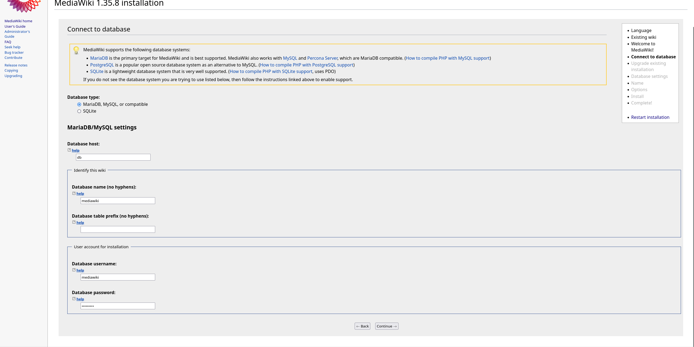
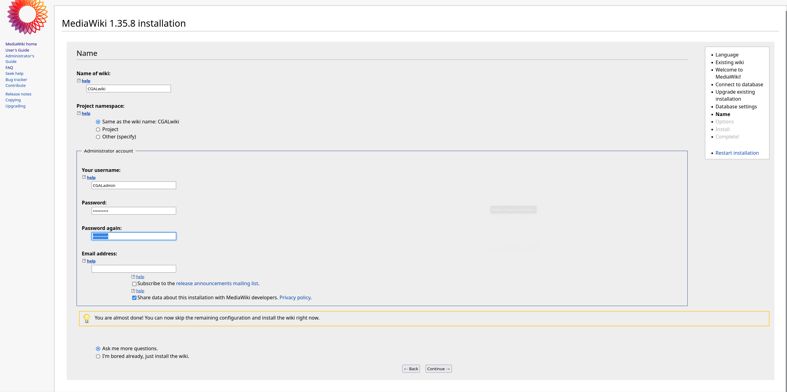
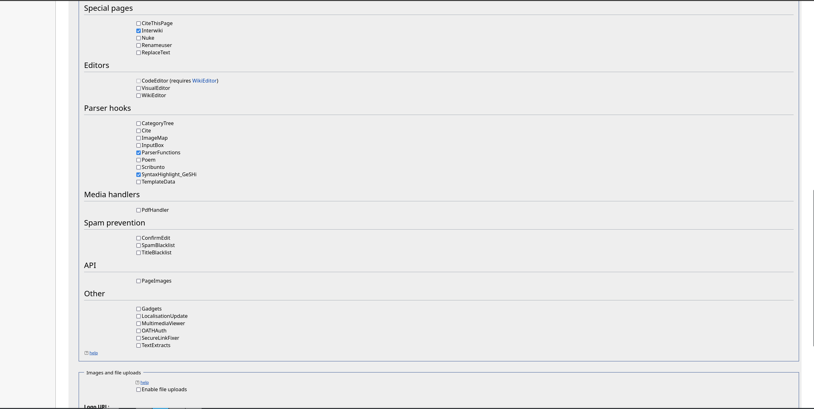

# First launch of docker-compose:
- Run docker-compose up
```
    docker-compose up -d
```
- Go to localhost:8080

# Creating LocalSettings.php:
```
    dtabase host : db
    database name (no hyphens) : mediawiki
    database username: mediawiki
    database password: mediawiki
```


```
    wiki name: CGALwiki
    check "Ask me more questions"
```


## See for other configuration
extensions to check:
```
    Special pages:
        - Interwiki
    Parser hooks:
        - ParserFunctions
        - SyntaxHighlight_GeSHi
```


# After generating the LocalSettings.txt
Put the LocalSettings.php at the root of the mediawiki folder
```
docker-compose stop
```
# Extensions
run the script
```
    ./scriptmediawiki.sh
```
To update these libraries
```
    composer update
```
go to localhost:8080

reload the localhost:8080 page to check if everything is working
go to http://localhost:8080/index.php/Special:Version
and check that the extensions and libraries are properly installed

# Importing the database
Import the dump
```
    docker exec -i <container_name_mariadb> mysql -u <database_user> -p<user_password> <database_name> < <the_dump>
```
Change the prefix in LocalSettings.php
```
    $wgDBprefix = "<prefix>";
    (cgal_members_)
```
restart the containers
```
    docker-compose restart
```
run mediawiki update
```
    docker exec -ti <container_name_mediawiki> php /var/www/html/maintenance/update.php
```